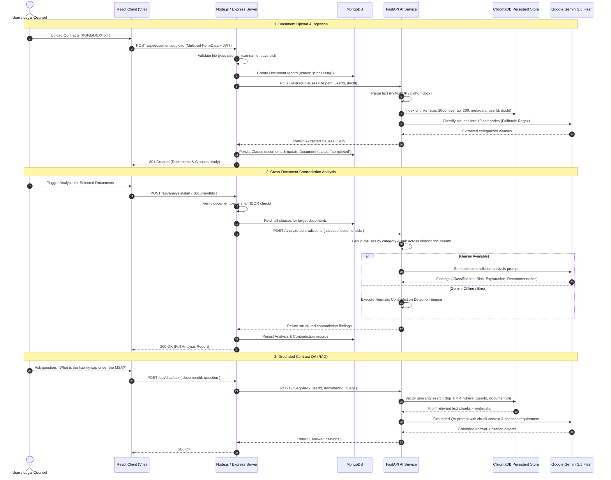

# ClauseGuard AI — System Architecture

ClauseGuard AI is an automated LegalTech contract review and cross-document contradiction detection platform. It enables legal teams, procurement managers, and compliance officers to upload multiple contractual instruments (e.g., Master Services Agreements, Non-Disclosure Agreements, Service Level Agreements, Statements of Work) and automatically extract clauses, identify semantic contradictions, assess operational and legal risks, and query contracts using retrieval-augmented generation (RAG).

---

## 1. Architectural Style

ClauseGuard AI employs a **Modular Service-Oriented Architecture (SOA)** with decoupled frontend, API orchestration, and AI reasoning layers:

```
[ Web Browser Client ]
       │  (HTTPS / REST / JWT)
       ▼
[ Node.js / Express API Gateway ] ─── [ MongoDB / Mongoose ]
       │                               (Users, Documents, Analyses, Fallback JSON)
       │  (Internal HTTP REST)
       ▼
[ Python / FastAPI AI Service ]
       ├── [ LangChain / Recursive Chunking (1000 / 200) ]
       ├── [ Persistent ChromaDB Vector Store ] (Tenant-isolated embeddings)
       └── [ Google Gemini 2.5 Flash / Heuristic Fallback Engine ]
```

### Why Modular Service-Oriented Instead of Monolithic or Microservice Mesh?
1. **Separation of Concerns**: Node.js/Express excels at asynchronous I/O, file streaming (Multer), JWT authentication, rate limiting, and business domain persistence. Python/FastAPI provides native access to PyMuPDF, `python-docx`, SentenceTransformers, LangChain, and ChromaDB.
2. **Operational Simplicity**: Unlike a distributed microservices mesh with complex service discovery and distributed tracing overhead, ClauseGuard AI runs two dedicated, high-performance backends communicating via predictable internal REST contracts.
3. **Resilience & Graceful Degradation**: If the external LLM provider experiences latency or outages, the Python AI service falls back to local heuristic contradiction detection rules. If MongoDB is unavailable during local development or evaluation, Express seamlessly falls back to a local JSON persistence layer.

---

## 2. Component Responsibilities

### 2.1 Frontend Client (`client/`)
- **Technology**: React 18, Vite, Tailwind CSS, Lucide React, Axios.
- **Responsibilities**:
  - User authentication interface (Registration, Login, Protected Route wrapper).
  - Document upload interface with drag-and-drop, format validation, and progress tracking.
  - Interactive analysis workspace displaying cross-document conflict cards, risk badges, clause comparisons, and AI recommendations.
  - Clause viewer enabling per-document, per-category inspection.
  - Contract QA assistant interface with grounded snippet citations.
  - Responsive, accessibility-conscious design free of distracting emojis or mock placeholders.

### 2.2 Backend Orchestrator (`server/`)
- **Technology**: Node.js, Express.js, Mongoose, Multer, Helmet, Express-Rate-Limit, JSONWebToken, Bcrypt.js.
- **Responsibilities**:
  - **Authentication & Authorization**: Stateless JWT verification and strict user-scoped tenancy enforcement.
  - **File Ingestion & Validation**: Enforcing 25 MB limits, file extension/MIME verification (`.pdf`, `.docx`, `.txt`), path traversal sanitization, and storage on disk.
  - **Orchestration**: Forwarding raw files and text to the FastAPI AI service for clause extraction, indexing, and contradiction analysis.
  - **Relational Domain Persistence**: Persisting document metadata, extracted clauses, analysis sessions, and contradiction findings in MongoDB.
  - **Security Hardening**: Enforcing CORS whitelists, HTTP security headers (Helmet), IP-based rate limiting, and IDOR validation on all entity queries.
  - **Transparent Error Handling**: Never returning synthetic mock data when the AI service is unreachable; returning explicit 503 Service Unavailable errors.

### 2.3 AI Service (`ai-service/`)
- **Technology**: Python 3.10+, FastAPI, Uvicorn, LangChain, PyMuPDF (`fitz`), `python-docx`, ChromaDB, Google Gemini API (`gemini-2.5-flash`).
- **Responsibilities**:
  - **Document Ingestion & Text Extraction**: Parsing text from PDF, DOCX, and TXT files with layout and page awareness.
  - **Text Chunking**: Recursive character splitting with `chunk_size = 1000` and `chunk_overlap = 200`.
  - **Persistent Vector Indexing**: Storing chunk embeddings in a disk-backed ChromaDB store (`./chroma_db`) tagged with `userId` and `documentId`.
  - **Clause Categorization**: Segmenting contracts into 10 legal categories using Gemini 2.5 Flash, with deterministic regex keyword fallback.
  - **Cross-Document Contradiction Analysis**: Performing pairwise clause comparison across distinct documents within identical legal categories to detect direct conflicts, inconsistencies, or alignment.
  - **RAG Contract Querying**: Answering natural language questions strictly grounded in retrieved top-k (`k = 4`) contract chunks, outputting structured citations.

---

## 3. End-to-End Data Flow



---

## 4. Failure Modes and Resilience Strategy

| Failure Scenario | System Reaction | User Experience |
|---|---|---|
| **Python AI Service Offline** | Express catches `ECONNREFUSED` / timeout; returns HTTP `503 Service Unavailable`. No fake/mock data is emitted. | Client displays clear error banner stating AI service is unavailable, prompting retry. |
| **Google Gemini API Rate Limit / Downtime** | FastAPI catches API error; immediately falls back to Python regex clause extraction and rule-based heuristic contradiction detection. | Analysis completes successfully with flag indicating heuristic evaluation. |
| **MongoDB Connection Failure** | Express server catches connection error; logs warning and routes CRUD operations to local JSON storage (`server/data/db_fallback.json`). | Application remains functional for development and evaluation without crashing. |
| **Corrupted or Password-Protected Document** | PyMuPDF or `python-docx` raises parse exception; FastAPI returns structured `422 Unprocessable Entity` with error message. | Backend flags document as `failed` with descriptive reason shown in UI. |
| **Vector Store Missing Index** | Vector store queries fall back to in-memory cosine fallback store; RAG falls back to direct clause metadata search. | Chat query returns answer with best-effort context or clear notification. |
