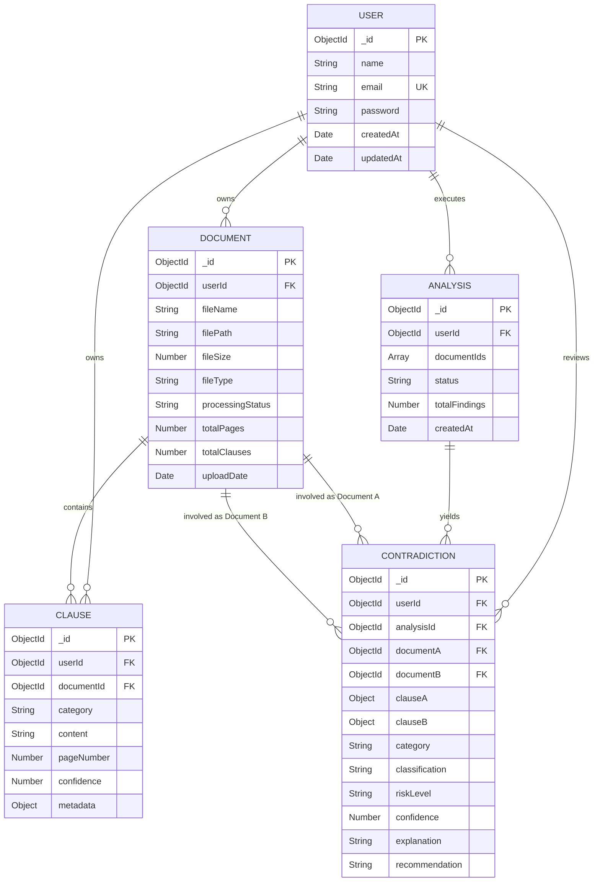

# ClauseGuard AI — Database & Persistence Design

ClauseGuard AI employs a hybrid dual-persistence model:
1. **Primary Operational Store (MongoDB)**: Persists transactional domain entities, users, document metadata, extracted clauses, and contradiction analysis results.
2. **Dense Vector Store (ChromaDB)**: Persists document embeddings and chunk representations for semantic retrieval and grounded question answering.
3. **Local JSON Fallback Store**: Provides zero-configuration persistence when MongoDB is unreachable in local or offline evaluation environments.

---

## 1. Entity-Relationship Model (MongoDB)



---

## 2. Schema Specifications

### 2.1 User Schema (`server/models/User.js`)
Stores authenticated user accounts.
```javascript
{
  name: { type: String, required: true, trim: true },
  email: { type: String, required: true, unique: true, lowercase: true, trim: true },
  password: { type: String, required: true }, // Bcrypt hash (salt rounds: 10)
  createdAt: { type: Date, default: Date.now },
  updatedAt: { type: Date, default: Date.now }
}
```
- **Indexes**: `email` (Unique Index).

---

### 2.2 Document Schema (`server/models/Document.js`)
Stores uploaded legal contracts and their processing lifecycles.
```javascript
{
  userId: { type: mongoose.Schema.Types.ObjectId, ref: 'User', required: true, index: true },
  fileName: { type: String, required: true },
  filePath: { type: String, required: true },
  fileSize: { type: Number },
  fileType: { type: String }, // 'application/pdf', 'application/vnd.openxmlformats...', 'text/plain'
  processingStatus: { 
    type: String, 
    enum: ['uploaded', 'processing', 'completed', 'failed'], 
    default: 'uploaded' 
  },
  totalPages: { type: Number, default: 0 },
  totalClauses: { type: Number, default: 0 },
  uploadDate: { type: Date, default: Date.now }
}
```
- **Indexes**: `userId` (B-Tree Index for tenant document filtering).

---

### 2.3 Clause Schema (`server/models/Clause.js`)
Stores individual extracted contractual clauses categorized by legal taxonomy.
```javascript
{
  userId: { type: mongoose.Schema.Types.ObjectId, ref: 'User', required: true, index: true },
  documentId: { type: mongoose.Schema.Types.ObjectId, ref: 'Document', required: true, index: true },
  category: { 
    type: String, 
    required: true,
    enum: [
      'PAYMENT', 'CONFIDENTIALITY', 'TERMINATION', 'LIABILITY',
      'DATA_PRIVACY', 'DATA_RETENTION', 'DATA_STORAGE',
      'JURISDICTION', 'INTELLECTUAL_PROPERTY', 'OTHER'
    ]
  },
  content: { type: String, required: true },
  pageNumber: { type: Number, default: 1 },
  confidence: { type: Number, default: 1.0 },
  metadata: { type: mongoose.Schema.Types.Mixed, default: {} }
}
```
- **Indexes**: Compound index on `{ userId: 1, documentId: 1 }` and single index on `category`.

---

### 2.4 Analysis Schema (`server/models/Analysis.js`)
Represents an analytical session comparing a designated set of documents.
```javascript
{
  userId: { type: mongoose.Schema.Types.ObjectId, ref: 'User', required: true, index: true },
  documentIds: [{ type: mongoose.Schema.Types.ObjectId, ref: 'Document', required: true }],
  status: { 
    type: String, 
    enum: ['processing', 'completed', 'failed'], 
    default: 'processing' 
  },
  totalFindings: { type: Number, default: 0 },
  createdAt: { type: Date, default: Date.now }
}
```

---

### 2.5 Contradiction Schema (`server/models/Contradiction.js`)
Stores specific cross-document conflicts identified during an analysis run.
```javascript
{
  userId: { type: mongoose.Schema.Types.ObjectId, ref: 'User', required: true, index: true },
  analysisId: { type: mongoose.Schema.Types.ObjectId, ref: 'Analysis', required: true, index: true },
  documentA: { type: mongoose.Schema.Types.ObjectId, ref: 'Document', required: true },
  documentB: { type: mongoose.Schema.Types.ObjectId, ref: 'Document', required: true },
  clauseA: { type: mongoose.Schema.Types.Mixed, required: true },
  clauseB: { type: mongoose.Schema.Types.Mixed, required: true },
  category: { type: String, required: true },
  classification: { 
    type: String, 
    enum: ['POTENTIAL_CONTRADICTION', 'POTENTIAL_INCONSISTENCY', 'NO_SIGNIFICANT_CONFLICT', 'UNCERTAIN'] 
  },
  riskLevel: { 
    type: String, 
    enum: ['HIGH', 'MEDIUM', 'LOW'] 
  },
  confidence: { type: Number, default: 1.0 },
  explanation: { type: String, required: true },
  recommendation: { type: String, required: true }
}
```

---

## 3. Dual-Persistence Model: MongoDB vs ChromaDB

| Dimension | MongoDB | ChromaDB |
|---|---|---|
| **Data Nature** | Relational & Document Metadata | High-Dimensional Dense Vectors (Embeddings) |
| **Entities Stored** | Users, Upload Logs, Statuses, Clauses, Findings | 1000-char Text Chunks with Metadata |
| **Query Mechanism** | B-Tree Indexes, Exact Matching, Range Queries | Approximate Nearest Neighbor (ANN / Cosine Similarity) |
| **Consistency** | ACID transactions at document level | Read-after-write on persistent local directory |
| **Use Case** | Dashboards, Auth, Clause Viewer, Audit History | Grounded RAG Retrieval for Natural Language QA |

---

## 4. Local JSON Fallback Layer

Located in: `server/config/dbFallback.js` & `server/data/db_fallback.json`

If the MongoDB daemon is offline (`ECONNREFUSED 127.0.0.1:27017`):
1. The Express server catches the connection failure gracefully during startup.
2. An in-memory store backed by synchronized JSON file I/O activates transparently.
3. All controllers query through the fallback layer when Mongoose's connection state is disconnected.
4. Passwords remain bcrypt-hashed and tokens remain cryptographically valid.
